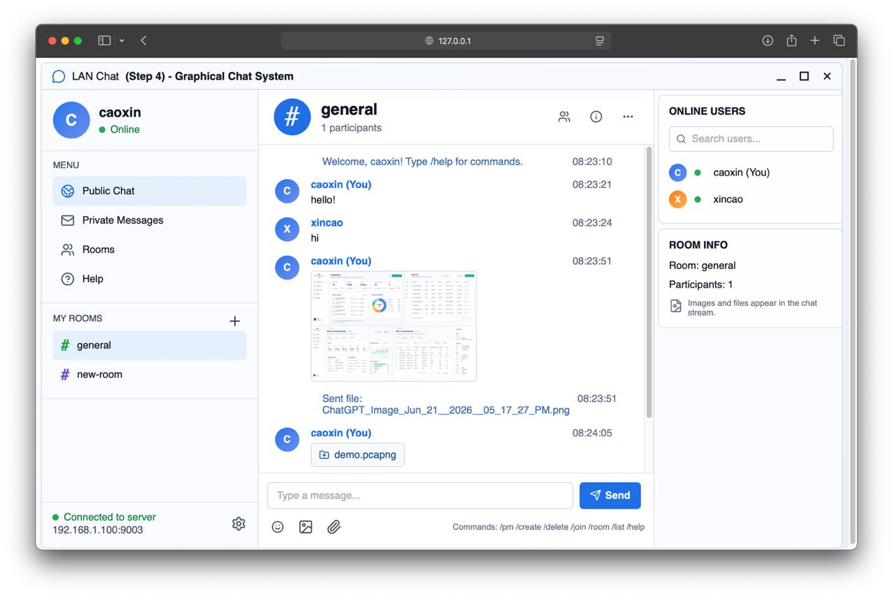

# HZCU Network Socket

A LAN chat application for the Computer Networks socket programming lab. The project is built in four incremental tasks, from a TCP echo server to a browser-based graphical chat system with rooms, private messages, file transfer, and image messages.

## Preview



## Features

- Task 1: TCP echo server and client.
- Task 2: multi-user public chat room with online and offline notices.
- Task 3: command-based chat with private messages and room management.
- Task 4: graphical web chat interface backed by TCP socket communication.
- Supports public chat, room chat, private messages, online users, rooms, help commands, file transfer, and image transfer.

## Requirements

- Python 3.10+
- `uv`
- Node.js and npm

## Setup

Install Python dependencies:

```bash
uv sync
```

Install the Task 4 web UI dependencies:

```bash
npm --prefix src/task4/ui install
```

## Run

### Task 1: TCP Echo

Start the server:

```bash
uv run src/task1/server0.py
```

Start a client in another terminal:

```bash
uv run src/task1/client0.py --server 127.0.0.1 --port 9000
```

### Task 2: Public Chat

Start the server:

```bash
uv run src/task2/server1.py
```

Start one or more clients:

```bash
uv run src/task2/client1.py --server 127.0.0.1 --port 9001
```

### Task 3: Commands And Rooms

Start the server:

```bash
uv run src/task3/server2.py
```

Start one or more clients:

```bash
uv run src/task3/client2.py --server 127.0.0.1 --port 9002
```

Supported commands include:

```text
/help
/list
/pm <user> <message>
/create <room>
/join <room>
/leave
/room <message>
```

### Task 4: Graphical Chat

Build the web UI:

```bash
npm --prefix src/task4/ui run build
```

Start the TCP chat server:

```bash
uv run src/task4/server3.py
```

Start the browser client gateway in another terminal:

```bash
uv run src/task4/client3.py --server 127.0.0.1 --port 9003
```

Open the local browser URL printed by the gateway, usually:

```text
http://127.0.0.1:8765/
```

If port `8765` is busy, the gateway chooses another local port.

For LAN testing, replace `127.0.0.1` with the server machine IP address.

## Test

Run the Python test suite:

```bash
uv run pytest
```

Run the Task 4 web UI tests:

```bash
npm --prefix src/task4/ui test
```

Build the Task 4 web UI:

```bash
npm --prefix src/task4/ui run build
```

## Project Structure

```text
src/task1/       TCP echo server and client
src/task2/       public chat server and client
src/task3/       command-based chat server and client
src/task4/       graphical chat server, browser gateway, and web UI
tests/           Python behavior and regression tests
docs/img/        README screenshots
```

## License

MIT License. See [LICENSE](LICENSE).
